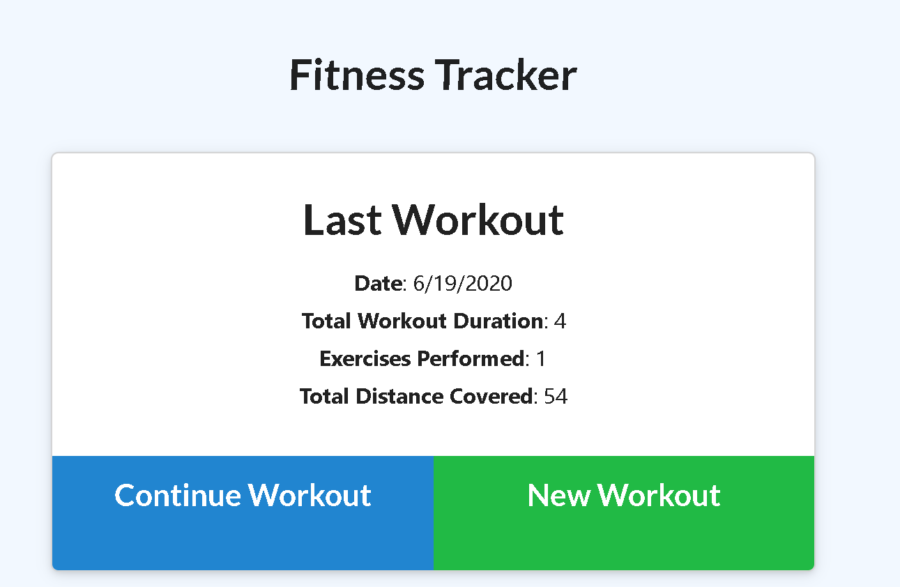
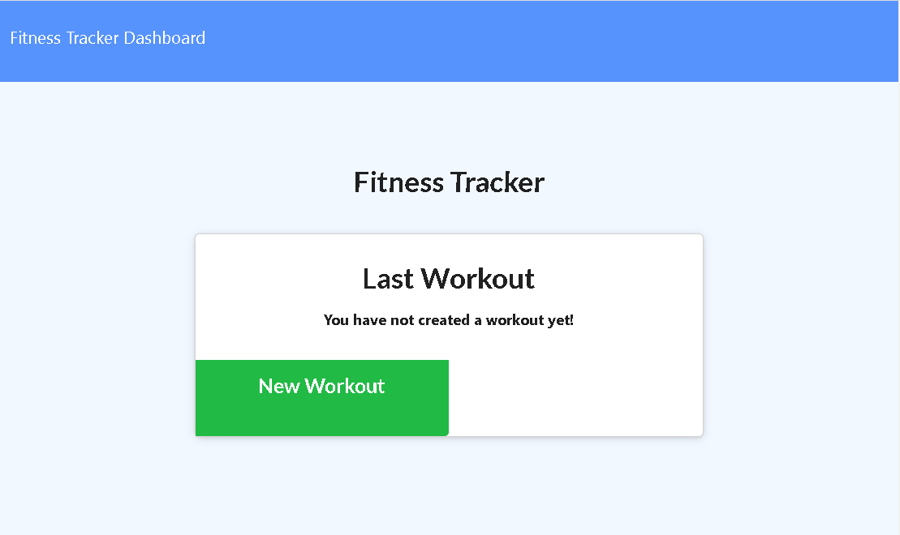

### Workout Tracker
#

## This is a simple Workout tracking application where when you can input the types of exercises you do and have the workout tracker track your total time you have spent working out, the last date of your workout, the amount of exercises you performed, and the total distance you covered in all your workouts.
##
<a href="https://boiling-tundra-74893.herokuapp.com/">

## This application uses Routes, Mongoose, MongoDB, nodeJS as well as Heroku

# Built with

## Prerequistes

## Instructions
#
1. Download Visual Studio code from https://code.visualstudio.com/download 
#
2. Download nodeJS compiler from https://nodejs.org/en/download/current/
#
3. Download mongoDB from https://www.mongodb.com/try/download/community
#
4. Install the software
#
5. do a clone with https and download the source code
#
6. Launch the command prompt or if you have gitbash installed launch gitbash
#
7. Run node server.js
#
8. Open your web browser and go to localhost:3000

## Alternate Instructions
#
1. visit https://boiling-tundra-74893.herokuapp.com/ to run the application from heroku

